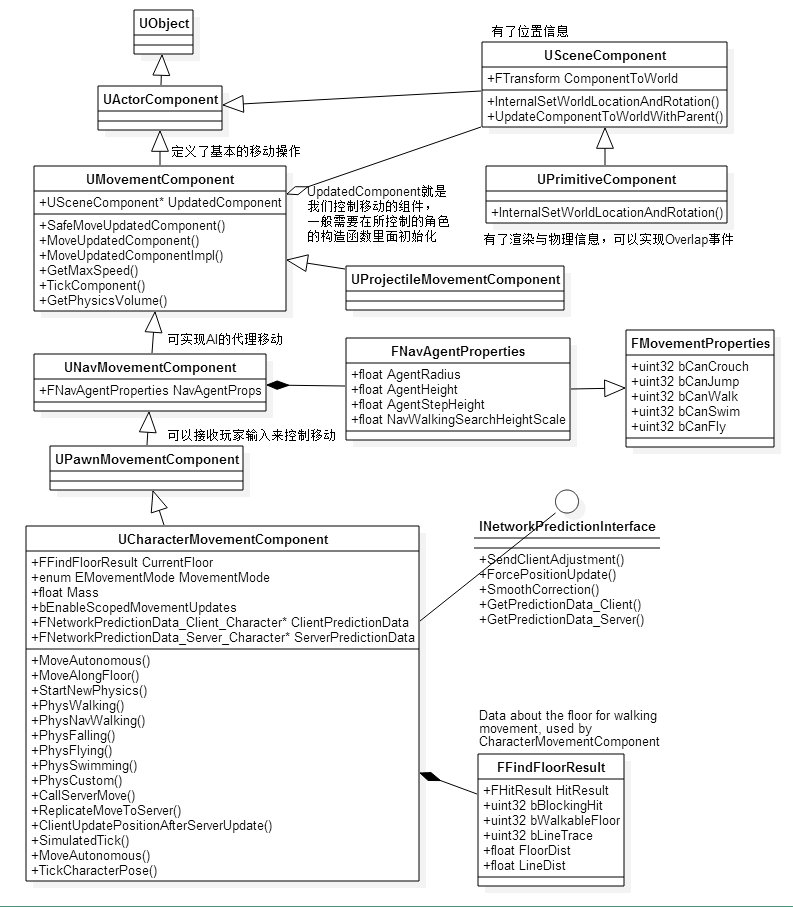
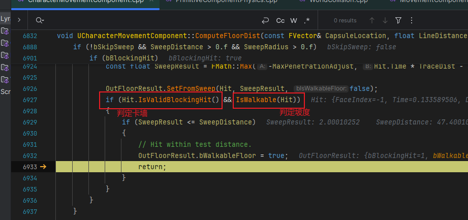
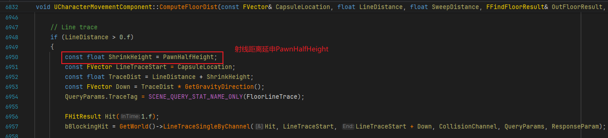
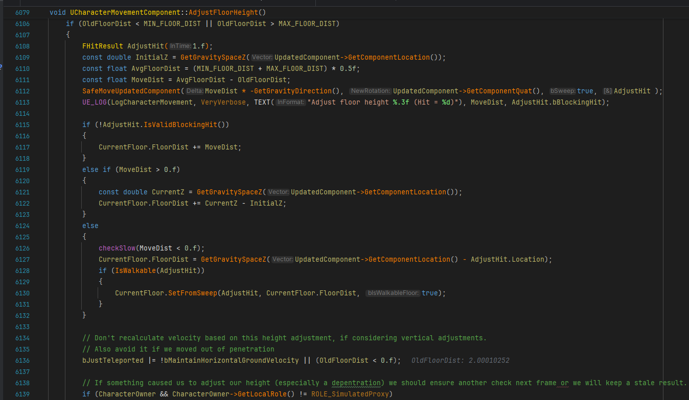
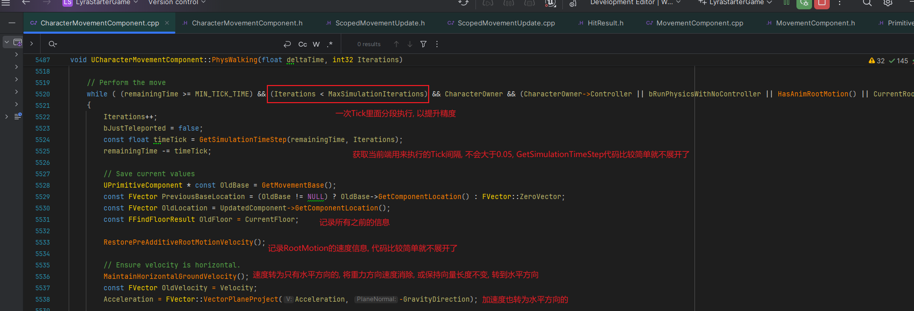

## REFERENCE
https://zhuanlan.zhihu.com/p/34257208
   

### 1.移动组件基本原理
移动组件在初始化的时候会把胶囊体设置为移动基础组件UpdateComponent，随后的操作都是在计算UpdateComponent的位置
当然，我们也并不是一定要设置胶囊体为UpdateComponent，对于DefaultPawn会把他的SphereComponent作为UpdateComponent
   

### 2.关系图
#### 2.1继承树

UPawnMovementComponent组件开始可以和玩家交互, 提供了AddInputVector()接收玩家输入, 玩家通过InputComponent组件绑定一个按键操作，然后在按键响应时调用Pawn的AddMovementInput接口，进而调用移动组件的AddInputVector()，调用结束后会通过ConsumeMovementInputVector()接口消耗掉该次操作的输入数值，完成一次移动操作

最后到了UCharacterMovement, 是基于胶囊体实现的, 所以目前不带胶囊体的Actor是无法正常使用的
  

#### 2.2移动框架相关类图

   

### 3.各个状态细节处理
#### 3.1Walking
##### 3.1.1CurrentFloor信息初始化, 由Possess触发

  

##### 3.1.2FindFloor流程分析
FindFloor本质上就是通过胶囊体的Sweep检测来找到脚下的地面，所以地面必须要有物理数据，而且通道类型要设置与玩家的Pawn有Block响应。这里还有一些小的细节，比如我们在寻找地面的时候，只考虑脚下位置附近的，而忽略掉腰部附近的物体\
Sweep用的是胶囊体而不是射线检测，方便处理斜面移动，计算可站立半径等
  

##### 3.1.3FindFloor详细流程
UCharacterMovementComponent::FindFloor:\
TraceDist大体由MaxStepHeight决定, 最小值为MAX_FLOOR_DIST, 默认值为2.4f, 是用来解决精度问题的:

先放一张胶囊体Sweep检测的示意图, 比LineTrace更好用于处理斜面检测:

UCharacterMovementComponent::ComputeFloorDist:\
来到ComputeFloorDist函数中, 传入的SweepRadius为对应胶囊体的Radius:
\
获取Sweep参数并开始SweepTest, 起点为CapsuleLocation, 终点为TraceDist*重力方向(TraceDist之前主要由MaxStepHeight决定):
\
判定是否在可容忍的边缘范围中:
\
判定卡墙(penetration)和坡度等条件, 通过则为检测到地面:
\
如果卡墙了或者角度不够, 之后还会打一条额外增加了Pawn的HalfHeight的LineTrace:
\
至此整个ComputeFloorDist流程结束, 来到FindFloor的可栖息(perch)范围验证阶段

验证胶囊体是否处于perch范围, 由PerchRadiusThreshold属性来控制, 默认这个值为0，移动组件会忽略这个可站立半径的相关计算，一旦这个值大于0.15，就会做进一步的判断看看当前的地面空间是否足够让玩家站立在上面:

UCharacterMovementComponent::ShouldComputePerchResult:\

UCharacterMovementComponent::ComputePerchResult:\
计算perch通过加大检测距离来加大胶囊体sweep检测的幅度, 因为胶囊体下半部圆弧与胶囊体真正底部有高度差
\
至此整个FindFloor流程结束
  

##### 3.1.4AdjustFloorHeight
在初始化过程中的FindFloor结束后, 紧接着进入AdjustFloorHeight流程:

UCharacterMovementComponent::AdjustFloorHeight:\
首先如果CurrentFloor信息是通过LineTrace得到的(也就是ComputeFloorDist在胶囊体Sweep过程中发现卡墙/角度不对的情况时多做的LineTrace), 需要修改OldFloorDist为LineTrace的长度:

最后处理浮空/卡墙, 将UpdatedComponent进行贴地处理:

至此整个AdjustFloorHeight流程结束
  

##### 3.1.5SetBaseFromFloor
在初始化过程中的AdjustFloorHeight结束后, 紧接着进入SetBaseFromFloor流程:

UCharacterMovementComponent::SetBase:\
内部实现主要是判断是否为WalkableFloor, 然后进行不同参数的SetBase, 如果是需要强制用Attachment的Base, 会进行单独处理, 之后在Character类中会触发Base改变的委托, 主要是用来判断是否能站在其他Character头顶之类的行为, 代码比较简单不再赘述:

至此整个初始化流程结束
  

##### 3.1.6PhysWalking
来到正式流程的PhysWalking阶段:

UCharacterMovementComponent::PhysWalking:\
上来就是一堆有效性/初始化相关的代码, 直接略过来到注释Perform the move的位置:
\
为了表现的更为平滑流畅, UE把一个Tick的移动分成了N段处理(每段的时间不能超过MaxSimulationTimeStep). 在处理每段时, 首先把当前的位置信息/地面信息记录下来, 把速度也做一些处理操作再缓存下来

然后来到Apply对应速度的阶段, 如果没有使用RootMotion会先来到CalcVelocity的速度计算阶段:\

UCharacterMovementComponent::CalcVelocity:
首先根据不同条件获取对应的速度相关值:\

