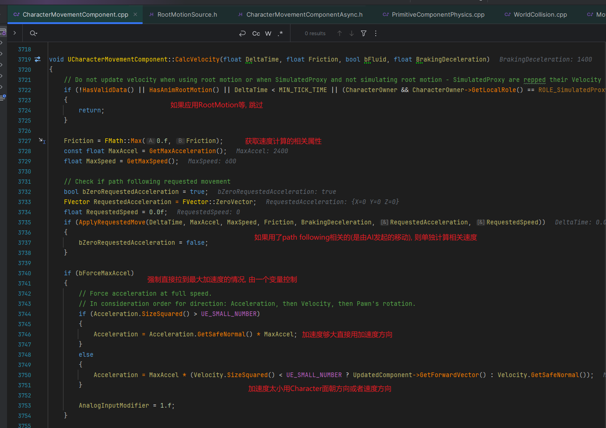
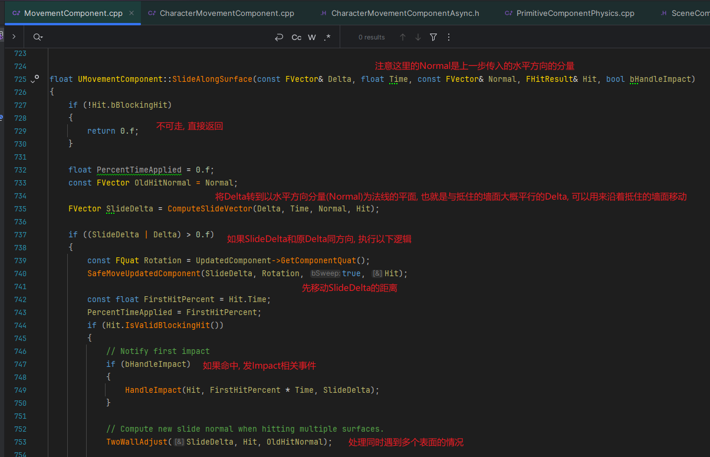
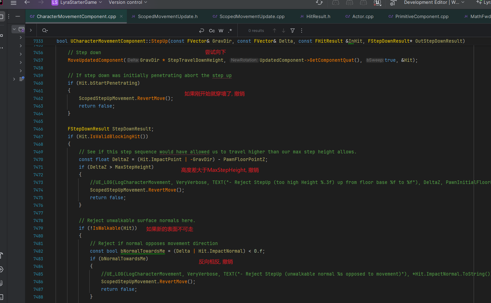
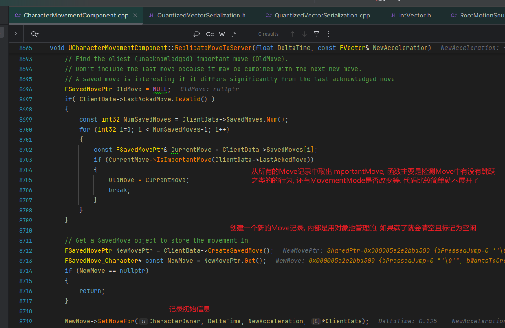

## REFERENCE
https://zhuanlan.zhihu.com/p/34257208\
https://www.bearchild.top/2024/06/10/%E6%B8%B8%E6%88%8F%E5%BC%80%E5%8F%91/3C/%5BUE%5DCharacterMovement%E6%BA%90%E7%A0%81%E6%B5%85%E6%9E%90/
   

### 1.移动组件基本原理
移动组件在初始化的时候会把胶囊体设置为移动基础组件UpdateComponent，随后的操作都是在计算UpdateComponent的位置
当然，我们也并不是一定要设置胶囊体为UpdateComponent，对于DefaultPawn会把他的SphereComponent作为UpdateComponent
   

### 2.关系图
#### 2.1继承树

UPawnMovementComponent组件开始可以和玩家交互, 提供了AddInputVector()接收玩家输入, 玩家通过InputComponent组件绑定一个按键操作，然后在按键响应时调用Pawn的AddMovementInput接口，进而调用移动组件的AddInputVector()，调用结束后会通过ConsumeMovementInputVector()接口消耗掉该次操作的输入数值，完成一次移动操作

最后到了UCharacterMovement, 是基于胶囊体实现的, 所以目前不带胶囊体的Actor是无法正常使用的
  

#### 2.2移动框架相关类图

   

### 3.各个状态细节处理
#### 3.1Walking

##### 3.1.1CurrentFloor信息初始化, 由Possess触发

  

##### 3.1.2FindFloor流程分析
FindFloor本质上就是通过胶囊体的Sweep检测来找到脚下的地面，所以地面必须要有物理数据，而且通道类型要设置与玩家的Pawn有Block响应。这里还有一些小的细节，比如我们在寻找地面的时候，只考虑脚下位置附近的，而忽略掉腰部附近的物体\
Sweep用的是胶囊体而不是射线检测，方便处理斜面移动，计算可站立半径等
  

##### 3.1.3FindFloor详细流程
UCharacterMovementComponent::FindFloor:\
TraceDist大体由MaxStepHeight决定, 最小值为MAX_FLOOR_DIST, 默认值为2.4f, 是用来解决精度问题的:

UCharacterMovementComponent::ComputeFloorDist:\
来到ComputeFloorDist函数中, 传入的SweepRadius为对应胶囊体的Radius:
\
获取Sweep参数并开始SweepTest, 起点为CapsuleLocation, 终点为TraceDist*重力方向(TraceDist之前主要由MaxStepHeight决定):
\
判定是否在可容忍的边缘范围中:
\
判定卡墙(penetration)和坡度等条件, 通过则为检测到地面:
\
如果卡墙了或者角度不够, 之后还会打一条额外增加了Pawn的HalfHeight的LineTrace:
\
至此整个ComputeFloorDist流程结束, 来到FindFloor的可栖息(perch)范围验证阶段

验证胶囊体是否处于perch范围, 由PerchRadiusThreshold属性来控制, 默认这个值为0，移动组件会忽略这个可站立半径的相关计算，一旦这个值大于0.15，就会做进一步的判断看看当前的地面空间是否足够让玩家站立在上面:

UCharacterMovementComponent::ShouldComputePerchResult:\

UCharacterMovementComponent::ComputePerchResult:\
计算perch通过加大检测距离来加大胶囊体sweep检测的幅度, 因为胶囊体下半部圆弧与胶囊体真正底部有高度差
\
至此整个FindFloor流程结束
  

##### 3.1.4AdjustFloorHeight
在初始化过程中的FindFloor结束后, 紧接着进入AdjustFloorHeight流程:

UCharacterMovementComponent::AdjustFloorHeight:\
首先如果CurrentFloor信息是通过LineTrace得到的(也就是ComputeFloorDist在胶囊体Sweep过程中发现卡墙/角度不对的情况时多做的LineTrace), 需要修改OldFloorDist为LineTrace的长度:

最后处理浮空/卡墙, 将UpdatedComponent进行贴地处理:

至此整个AdjustFloorHeight流程结束
  

##### 3.1.5SetBaseFromFloor
在初始化过程中的AdjustFloorHeight结束后, 紧接着进入SetBaseFromFloor流程:

UCharacterMovementComponent::SetBase:\
内部实现主要是判断是否为WalkableFloor, 然后进行不同参数的SetBase, 如果是需要强制用Attachment的Base, 会进行单独处理, 之后在Character类中会触发Base改变的委托, 主要是用来判断是否能站在其他Character头顶之类的行为, 代码比较简单不再赘述:

至此整个初始化流程结束
  

##### 3.1.6PhysWalking
来到正式流程的PhysWalking阶段:

UCharacterMovementComponent::PhysWalking:\
上来就是一堆有效性/初始化相关的代码, 直接略过来到注释Perform the move的位置:
\
为了表现的更为平滑流畅, UE把一个Tick的移动分成了N段处理(每段的时间不能超过MaxSimulationTimeStep). 在处理每段时, 首先把当前的位置信息/地面信息记录下来, 把速度也做一些处理操作再缓存下来

然后来到Apply对应加速度/摩擦力的阶段, 如果没有使用RootMotion会先来到CalcVelocity的速度计算阶段:\

UCharacterMovementComponent::CalcVelocity:\
首先根据不同条件获取对应的速度相关值:

接着来到摩擦力相关处理:

再来到加速度相关处理:

至此整个CalcVelocity流程结束, 速度计算完成

CalcVelocity处理的是不带RootMotion的情况, 接着来到带RootMotion的情况:

简单来说就是应用动画Root骨骼的曲线来进行速度应用, RootMotion处理运动之后可能会跳出当前的PhysWalking状态, 因为直接应用曲线来设置速度可能出现Z轴向上的情况之类的改变MovementMode而提前return, 具体的就不展开了

处理完RootMotion之后来到MoveAlongFloor阶段, 也就是Character真正应用移动的位置:
\
先进行位置偏移计算, 如果偏移为0直接return, 偏移大于0进入MoveAlongFloor

UCharacterMovementComponent::MoveAlongFloor:\
先将速度取水平方向, 然后进入ComputeGroundMovementDelta:

UCharacterMovementComponent::ComputeGroundMovementDelta:\
先放一张胶囊体Sweep检测的示意图, 可以看到ImpactNormal和Normal的区别用于处理斜面检测:

再回到ComputeGroundMovementDelta这个函数, 主要处理的是输入的水平移动量转到平行于斜面移动量的过程:

接下来来到SafeMoveUpdatedComponent:

代码里主要是调用了SceneComponent的MoveComponent, 并且根据Sweep结果处理穿墙的情况, 代码比较简单就不展开了

回到MoveAlongFloor中, 当经过SafeMoveUpdatedComponent之后, 检测道bStartPenetrating为true时, 可能是对应的Character一直是卡在墙里的状态, 进入下面的逻辑:

HnadleImpact和OnCharacterStuckInGeometry都很简单, 就不展开了, 详细看一下SlideAlongSurface的实现

UCharacterMovementComponent::SlideAlongSurface:\

计算完成后进入父类的SlideAlongSurface:

UMovementComponent::SlideAlongSurface:\
先沿平面移动一小段, 如果再次命中阻挡, 来到TwoWallAdjust进行靠墙的判断:

UMovementComponent:TwoWallAdjust:\
这个函数主要处理的是同时靠两面墙的判断:

在TwoWallAdjust之后使用调整后的SlideDelta再进行一次移动, 同样会判断与初始的Delta方向是否一致:\

至此整个SlideAlongSurface结束

回到MoveAlongFloor中, 接下来进入撞墙时的情况:
先往剩余的空间移动一小段距离, 抵住墙壁:

抵住墙壁后, 先判断CanStepUp, 主要是判断命中的PrimitiveComponent上的CanCharacterStepUpOn等属性, 过程比较简单就不展开了:

UCharacterMovementComponent::StepUp:\
随后来到StepUp的阶段:\

至此整个StepUp阶段结束

回到MoveAlongFloor中, 处理StepUp成功/失败之后的行为:

至此整个MoveAlongFloor结束, 回到PhysWalking中

MoveAlongFloor结束后, 紧接着处理由MoveAlongFloor造成的MovementMode改变/地面信息改变等:

再接着处理在悬崖边缘的移动, 这部分功能的开启由CharacterMovementComponent上的bCanWalkOffLedges变量控制, 先大致看一下过程:

重点主要在GetLedgeMove上, 主要处理的是沿着悬崖边缘的移动行为:\
UCharacterMovementComponent::GetLedgeMove:

其中再进一步查看CheckLedgeDirection的实现:\
UCharacterMovementComponent::CheckLedgeDirection:

沿悬崖边缘移动处理过程结束

接着开始处理可以掉下悬崖的情况:

至此整个悬崖边缘的处理过程结束

在PhysWalking的最后, 会将计算得出的速度转到水平方向:

至此整个PhysWalking结束

##### 3.1.7移动同步
###### Autonomous同步的处理
Autonomous相关同步处理主要在ReplicateMoveToServer中, 先放一张框架图:

主要维护三种Move数据:
OldMove: 当前还未被DS ACK的Move数据中, 最早的一次Move
NewMove: 本次执行的Move
PendingMove: 若某次NewMove还未进行同步(等待并包), 将其存储在PendingMove中, 等待下次同步带上该数据
在CallServerMovePacked时, 打包三种Move同步

Autonomous的移动处理主要在Tick的ReplicateMoveToServer中, 先判断LocalRole, 之后进入ReplicateMoveToServer:

先进行一些有效性判断和ClientData的生成:

随后来到TimeStamp的更新:
先检查是否要重置时间戳以提升浮点精度, 再应用ClientDeltaTime:

再将客户端的DeltaTime应用成将会发送给Server的, 避免CharacterMovement用来计算的浮点误差越来越大最后导致位置矫正

TimeStamp更新结束

接下来从移动缓存中获取ImportantMove, 通过检查移动缓存中的重要状态标记/检查MovementMode是否改变等, 最后再获取新的Move数据指针:

来到SetMoveFor, 主要是记录初始信息:

接下来就是两个SavedMove的合并, 主要是把差异不大的输入信息合并, 用来减少传输带宽
