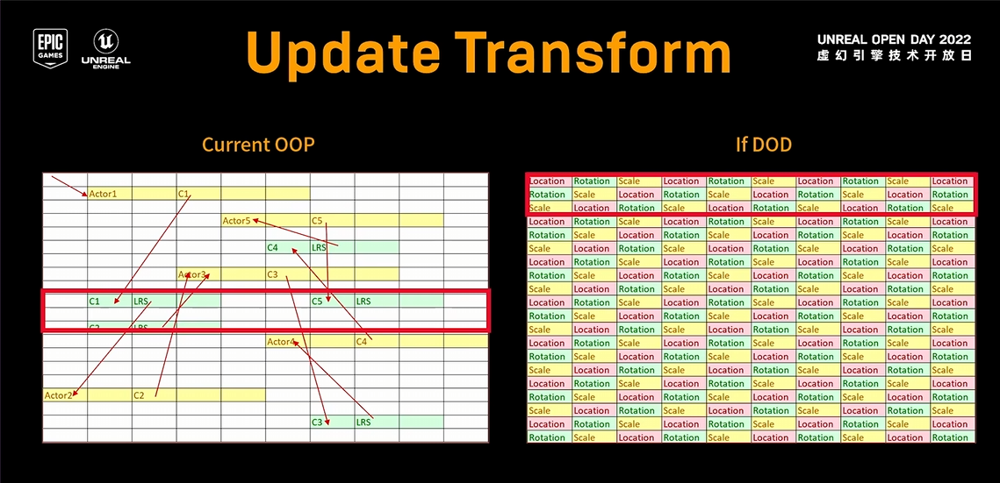
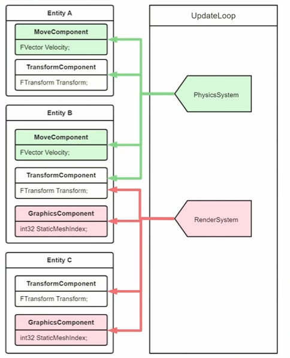
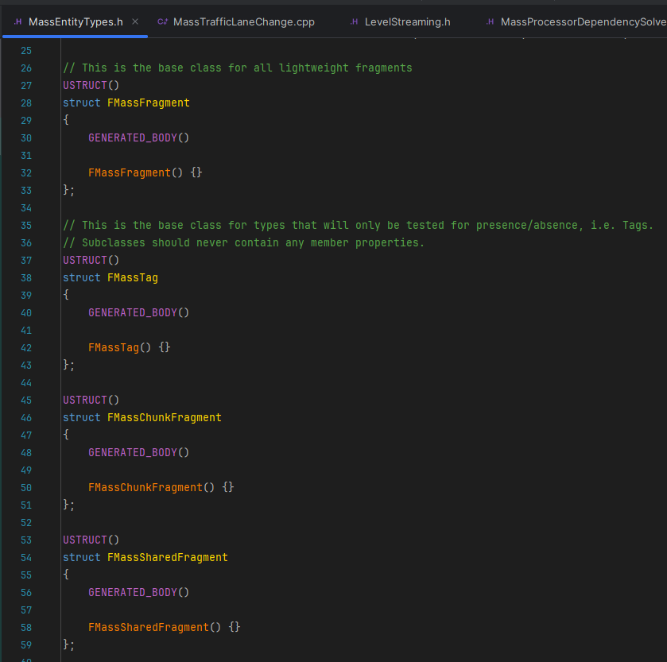
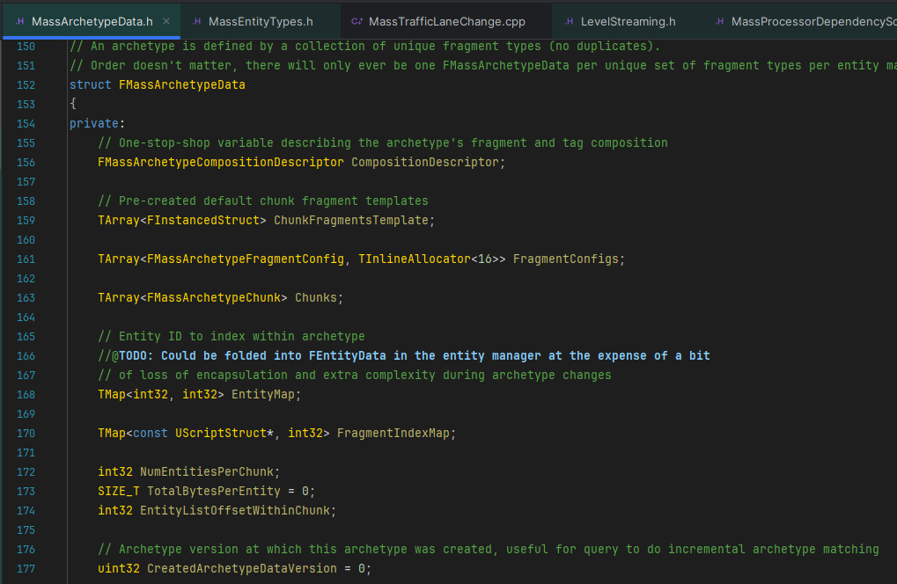
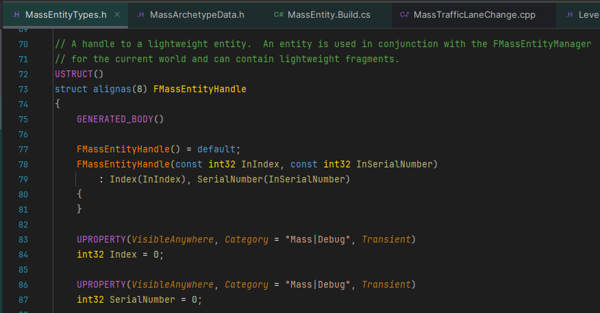

#### 对应版本: UE5.5

## REFERENCE
https://zhuanlan.zhihu.com/p/552884861 \
https://www.bilibili.com/video/BV13D4y1v7xx/?share_source=copy_web&vd_source=9e4b8161f6ae78cfba6a741d8818e177
<br><br><br>

### 1.SOA/AOS
首先来看一下两种典型的数据排布:
```
// Array of structures (AOS)
struct Particle {float x, y, z, w};
Particle particles[1000];

// Structure of arrays (SOA)
struct Particles {
    float x[1000];
    float y[1000];
    float z[1000];
    float w[1000];
};
```

SOA的好处是一个属性(比如上面例子中的x)在不同结构体中的数据在内存中地址是连续的, 而如果有一些操作只用到其中的几个属性(比如只用到x, 而没用到y, z, w), 在AOS下处理器依然会将y, z, w调入Cache中, 那么会浪费y, z, w的内存带宽并且可能造成Cache miss, 而且SOA更适合SIMD, 一些运算的吞吐量更高

如果数组大小特别小, 能够完全塞进CPU缓存(一般 L3 cache 是每个core 有1.5~2MB, L2是256KB, L1是32KB), 那么或许排布对于性能的影响并不大. 但是一旦数组规模超过2MB左右, 就需要特别在意访存问题

ECS架构本身就是利用SOA提升Cache的命中率, 并利用SIMD指令来加速计算

这两种数据排布的区别在设计上通常分被OOP和DOD的设计思想应用:

<br><br>

### 2.MASS框架
ECS架构中E/C/S分别代表什么?
把数据分成一个个Component, 然后由Component组成Entity, 再用System使用逻辑对Component进行处理:\

<br><br>

#### 2.1Fragment
在Mass中, Fragment代表ECS中的Component, 因为Component这个名词在引擎里已经被占用了, Fragment自然代表的就是一个内存片段, 只包含最纯粹的数据:

FMassFragment是定义每个Entity内部的数据结构\
FMassChunkFragment是Chunk的额外内存数据, 每个Chunk内共享一份\
FMassSharedFragment是共享的布局\
我们可以定义自己的Fragment继承自对应的MassFragment, 如果需要在编辑器内编辑, 可以对对应的变量加UPROPERTY宏. 如果需要加函数, 那么函数不能是虚函数, 因为对象地址开头的虚表指针会破坏ECS的范式

总的来说, 如果FMassFragment可以理解为Entity的成员变量, 那FMassSharedFragment就可以理解为Entity的static成员变量, 而FMassChunkFragment可以理解为每个Chunk的static成员变量, Chunk具体在后文解答
<br><br>

#### 2.2Archetype
Archetype定义:

一个Archetype由多个Fragment进行顺序无关的排列组合而成, 它是唯一的

Archetype的存储:


#### 2.3Entity
Entity定义:

一个EntityHandle由一个Index和一个SerialNumber组成, Index表示自己是在Archetype大数组中的哪一份, SerialNumber用来做数据校验, 作用就是某个Index上的Entity被删除后, 再创建个新的Entity, 如果原来Index指向的EntityData和EntityHandle序列号不匹配, 就可以明确EntityHandle指向的是老的Entity而不是新的, 这样就避免了只用Index标记Entity导致的冲突问题

