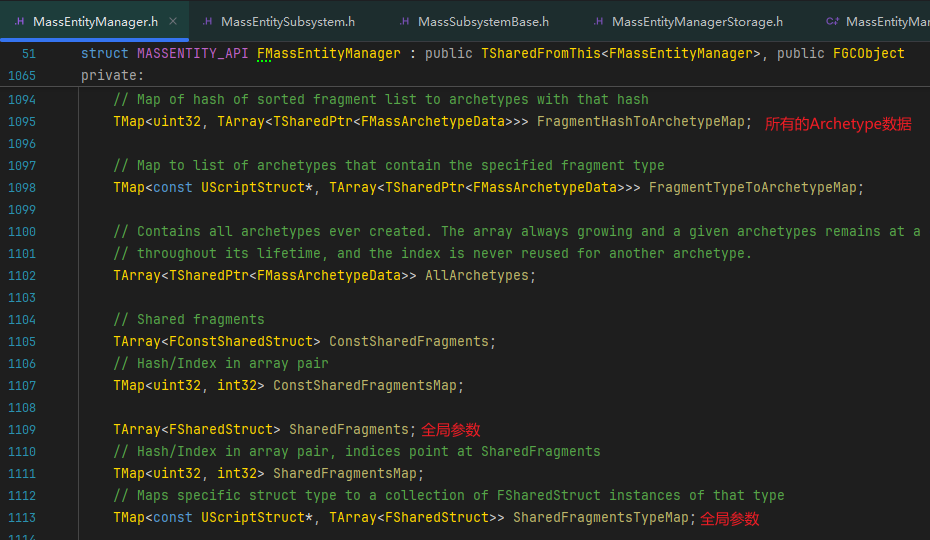
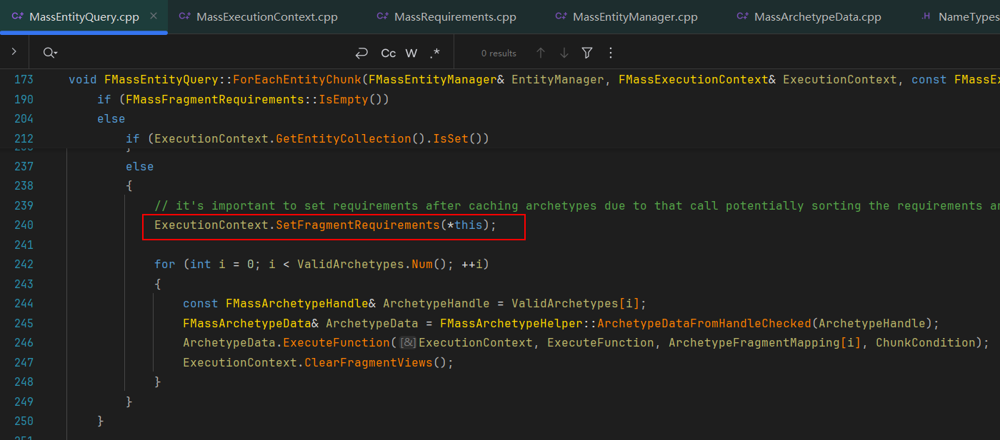
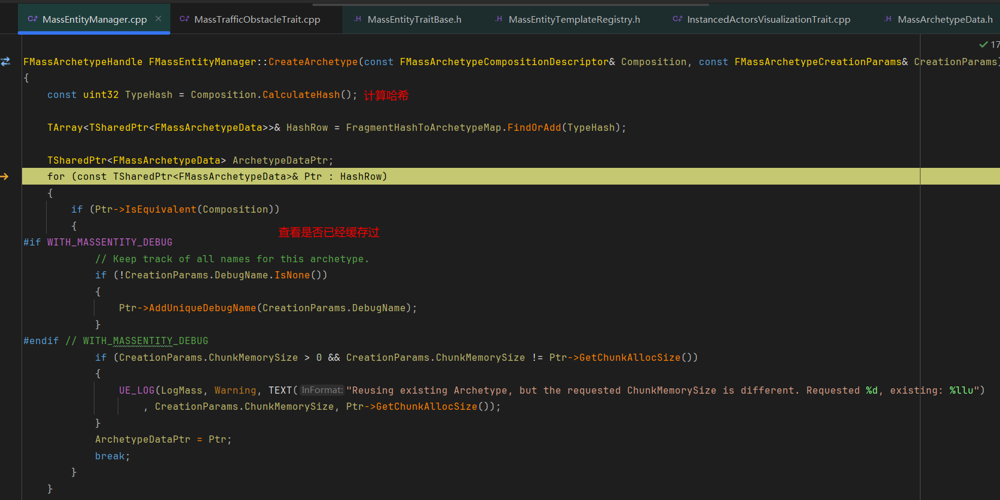

#### 对应版本: UE5.5

## REFERENCE
https://zhuanlan.zhihu.com/p/552884861 \
https://www.bilibili.com/video/BV13D4y1v7xx/?share_source=copy_web&vd_source=9e4b8161f6ae78cfba6a741d8818e177
<br><br><br>

### 1.SOA/AOS
首先来看一下两种典型的数据排布:
```
// Array of structures (AOS)
struct Particle {float x, y, z, w};
Particle particles[1000];

// Structure of arrays (SOA)
struct Particles {
    float x[1000];
    float y[1000];
    float z[1000];
    float w[1000];
};
```

SOA的好处是一个属性(比如上面例子中的x)在不同结构体中的数据在内存中地址是连续的, 而如果有一些操作只用到其中的几个属性(比如只用到x, 而没用到y, z, w), 在AOS下处理器依然会将y, z, w调入Cache中, 那么会浪费y, z, w的内存带宽并且可能造成Cache miss, 而且SOA更适合SIMD, 一些运算的吞吐量更高

如果数组大小特别小, 能够完全塞进CPU缓存(一般 L3 cache 是每个core 有1.5~2MB, L2是256KB, L1是32KB), 那么或许排布对于性能的影响并不大. 但是一旦数组规模超过2MB左右, 就需要特别在意访存问题

ECS架构本身就是利用SOA提升Cache的命中率, 并利用SIMD指令来加速计算

这两种数据排布的区别在设计上通常分被OOP和DOD的设计思想应用:

<br><br>

### 2.MASS框架内存布局
ECS架构中E/C/S分别代表什么?
把数据分成一个个Component, 然后由Component组成Entity, 再用System使用逻辑对Component进行处理:\

<br><br>

#### 2.1Mass的基本数据组成
数据构成:\
\
FMassFragment是定义每个Entity内部的数据结构\
FMassTag用来做Archetype的标签\
FMassChunkFragment是Chunk的额外内存数据, 每个Chunk内共享一份\
FMassSharedFragment是共享的布局\

<br><br>

#### 2.2Fragment
在Mass中, Fragment代表ECS中的Component, 因为Component这个名词在引擎里已经被占用了, Fragment自然代表的就是一个内存片段, 只包含最纯粹的数据, 对应的数据保存在ArchetypeChunk的RawMemory中:

关于FMassArchetypeChunk见后文的[Archetype的存储](#Archetype的存储)\

我们可以定义自己的Fragment继承自对应的MassFragment, 如果需要在编辑器内编辑, 可以对对应的变量加UPROPERTY宏. 如果需要加函数, 那么函数不能是虚函数, 因为对象地址开头的虚表指针会破坏ECS的范式

总的来说, 如果FMassFragment可以理解为Entity的成员变量, 那FMassSharedFragment就可以理解为Entity的static成员变量, 而FMassChunkFragment可以理解为每个Chunk的static成员变量, Chunk具体在后文解答
<br><br>

#### 2.3MassTag
FMassTag用来做Archetype的标签, 用来给Archetype分类, 比如敌军/友军AI, 他们的Archetype是一样的, 在之后的AI逻辑运算中就可以方便的用Tag对它们进行筛选
<br><br>

#### 2.4Archetype
Archetype定义:

一个Archetype由多个Fragment进行顺序无关的排列组合而成, 它是唯一的\
因为直接一个TArray会导致不好扩容, 并且内存跨越的也会很大, 所以Archetype的存储分为一个个Chunk, 也就是上图的Chunks变量

<a name="Archetype的存储"></a>
Archetype的存储:\
Archetype的存储分为一个个Chunk, 每个Chunk64或者128K对CPU Cache比较友好, 一次刚好能载入一个Chunk的数据

Chunk大小是我们自己定义的, 所以知道一个Chunk可以容纳多少个(图中的N)Entity的数据, 每个Chunk的开头也有对应的FMassEntityHandle来记录当前Chunk存放了哪些Entity

FMassArchetypeChunk:\


ChunkFragmentData: 独属于这一块Chunk的自定义附加数据, 用来给不同的Chunk分别定义一些不同的行为, 比如Chunk1的附加数据表示Chunk1中的所有Entity离玩家比较远了, 可以降低更新频率, Chunk2的附加数据表示Chunk2中的所有Entity离玩家近了, 可以提高更新频率

SharedFragmentValues: 比如重力/摩擦力等整个系统只有一份的, 可以多个Chunk共享, 不同的Chunk可以携带不同的SharedFragmentValues, 也可以没有
<br><br>

#### 2.5Entity
Entity定义:\
\
一个EntityHandle由一个Index和一个SerialNumber组成, Index表示自己是在Archetype大数组中的哪一份, SerialNumber用来做数据校验, 作用就是某个Index上的Entity被删除后, 再创建个新的Entity, 如果原来Index指向的EntityData和EntityHandle序列号不匹配, 就可以明确EntityHandle指向的是老的Entity而不是新的, 这样就避免了只用Index标记Entity导致的冲突问题
<br><br>

#### 2.6FMassArchetypeCompositionDescriptor
<a name="Descriptor"></a>
Descriptor:\
以上数据的描述都存储在ArchetypeData的CompositionDescriptor中, 顾名思义它是用来描述内存中的数据排布:\
\
\

可以看到在Descriptor中有许多BitSet, 它们的作用是记录不同的UScriptStruct类型, 用来在创建Archetype时传入类型信息. 比如向Descriptor的Fragments中Add一个继承自FMassFragment的类型, 会将Fragments中对应的位设为1, 把各个结构UStruct类型信息存在了一个数组里, 而且这样做大大节省了内存. BitSet在某些情况可以用来进行快速的位运算过滤, 比如查询Archetype是否含有特定的Fragment时. TStructTypeBitSet的具体原理此处不再赘述

<br><br>

#### 2.7FEntityHandle
先看一下由FEntityHandle到FMassArchetypeChunk对应的索引数据结构:


一个EntityHandle只需要一个32位Index就能知道自己属于哪个EntityData, 从而定位到对应的ArchetypeData, 还有一个序列号矫正, 比如Archetype升级了版本号已经改变了, 但原来的数据是外部存储的, 那么这个EntityHandle的序列号还是旧的, 这样就知道Handle已经失效了. ArchetypeData里面也有个EntityMap作为全局Index到内部Index的转换, 用来查找对应的Chunk

这样通过每个Chunk的Entity数量就可以得出对应的是第几个Chunk的第几号位置:

<br><br>

#### 2.8FMassEntityManager
所有Archetype的定义信息, 以及所有Entity都存储在一个全局的EntityManager中, 而EntityManager能在UMassEntitySubsystem中找到:


来看一下EntityManager的结构, 首先是EntityStorage, 它存储了所有的Entity数据


接下来就是全局参数和所有Archetype的数据


其他的就是一些对Archetype还有Entity操作的接口, 比如创建Archetype, 创建/移除Entity等, 这里就不再赘述了

最后看一下Entity的创建过程和MASS的数据结构组织


需要注意的是, 删除Entity会造成空洞, 不过下次再创建Entity的时候会被重复利用
改变Entity的Archetype会导致创建一个新的Archetype并迁移所有数据, 性能消耗非常大
<br><br>

### 3.运行机制
MASS在运行时需要筛选到我们关心的数据, 然后处理它们
<br><br>

#### 3.1Phase初始化
运行的每一帧分为很多个Phase, 具体如下\
\
和引擎的Tick阶段类似, 也需要根据Phase来决定, 每一帧的每个阶段来做什么, 比如AI相关的, 要在PrePhysics进行等等

在FMassProcessingPhaseManager的Initialize阶段, 会对Phase进行初始化, 还有PhaseProcessor的创建


<br><br>

#### 3.2Processor初始化
Processor顾名思义, 是最终用来处理Fragment数据, 处理业务逻辑的地方. 在引擎的初始化阶段, 会收集引擎中所有UMassProcessor的派生类型, 并且根据它们的ShouldAutoAddToGlobalList和ProcessingPhase分配到不同的PhaseConfig中


之后在PhaseStart阶段时, 先进行检查修改，有新的Archetypes创建/Processors需要Rebuild等, 然后根据这些来判断是否需要重新构建当前Phase对应的UMassCompositeProcessor


对Processor的依赖进行处理, 因为一个Processor可能与其它Processor之间有依赖关系, 需要等待其它Processor处理完对应数据后再执行, 详细可以见依赖节点(AllNodes)的创建流程和FMassProcessorDependencySolver


<a name="Processors的添加"></a>
在依赖关系处理完成之后, 会更新Phase对应的UMassCompositeProcessor, 将真正处理业务逻辑的Processors添加到其中


<br><br>

#### 3.3Processor的运行
在OnPhaseStart执行完, 也就是Processor初始化完成之后, 会开始当前Phase的Processor执行过程, 这里可以通过修改头文件开启并行. 官方默认是单线程跑的, 所以这里直接来到UE::Mass::Executor::Run


继续深入, 来到RunProcessorsView的ExecuteProcessors, 里面会调用Processor的CallExecute进行Processor的执行


上面是Phase对应的CompositeProcessor的执行, 在它的Execute中会执行Phase对应的所有业务逻辑相关的Processors, 也就是[之前在Processor初始化阶段往UMassCompositeProcessor中添加的Processors](#Processors的添加)


以UMassCharacterMovementToMassTranslator为例, 看一下Execute的时候做了什么

这里使用EntityQuery, 在ForEachEntityChunk中获取了对应的一系列Fragment, 通过CharacterMovement上的信息更新了对应Entity中的Location和Velocity, 那么EntityQuery和对应的ForEachEntityChunk是怎么得到对应的Entity中的Fragment数据的?
<br><br>

#### 3.4运行时数据筛选
Mass的业务层面, 通过EntityQuery进行数据筛选, 先筛选出合适的Archetype, 再对chunk进行筛选. 这一步主要是通过Tags, Fragments, ChunkFragments, SharedFragments分别定义上过滤器规则进行筛选, 筛选出需要的chunk并返回


先来看一下EntityQuery的初始化
.png)
可以看到往EntityQuery中添加了所需的一系列Fragment和Tag

最后都被添加到了EntityQuery中对应的BitSet里


然后来看一下ForEachEntityChunk里面做了什么, 还是以UMassCharacterMovementToMassTranslator为示例, 直接来到CacheArchetypes这一步:


前面会做一些Archetype是否更新之类的检查, 直接跳过, 来到GetMatchingArchetypes:


可以看到这一步会调用EntityQuery的DoesArchetypeMatchRequirements函数, 里面传入了Archetype对应的[Descriptor](#Descriptor), 之前Descriptor中存储的Archetype信息BitSet在这里发挥了用处, 只需要通过位运算就能得到当前的Archetype是否是EntityQuery想要的, 效率非常的高

回到CacheArchetypes中, 在获得需要的Archetype之后, 就可以开始获取EntityQuery需要的Fragment数据了


CacheArchetypes执行完成后, 会来到FMassExecutionContext的SetFragmentRequrements


这里会将EntityQuery中所需的Fragment信息传递给ExecutionContext

Fragment信息传递完成之后, 回到ForEachEntityChunk中


经过一系列操作后, 先将对应的一个Chunk中的所需Fragment数据装到一个FragmentView中, 给到对应的ExecutionContext, 至此数据筛选完成并且返回了一个Chunk的数据, 对CPU Cache非常友好

最后再执行我们在业务层写的函数, 就可以从Context中拿到所需的Fragment了


<br><br>

#### 3.5Entity之间通信
在Mass中, Entity之间通信依赖于UMassSignalSubsystem, 可以理解为对应的SignalProcessor向UMassSignalSubsystem订阅, 收到来自Subsystem的信号之后, 对Entity执行一些操作

以UMassStateTreeProcessor为例, Initialize阶段这里向SignalSubsystem注册了非常多的Signal类型


UMassStateTreeActivationProcessor在执行阶段, 会根据一系列条件, 挑选出激活StateTree的Entities, 然后调用UMassSignalSubsysem的SignalEntities来向UMassStateTreeProcessor发信号


最后这些Entities都会在订阅方的SignalEntities函数中接收, 过程十分简单, 建议从UMassStateTreeProcessor入手


### 4.官方CitySample的数据初始化流程解析
以Epic官方的CitySample项目为例\
在CitySample项目中进入PIE, 先来看一下堆栈, 主要是从Player的生成与初始化开始的, 入口在Player上的UMassAgentComponent, 代码比较简单就不再赘述了, 放一下初始化堆栈:\


接下来直接来到关键部分, 在UMassAgentComponent注册时, 会返回给UMassAgentSubsystem一个对应的FMassEntityConfig


来到蓝图里面具体看一下这个EntityConfig, 它是UMassAgentComponent上面的一个属性:

可以看到有一个Parent属性, 里面对应了一个UMassEntityConfigAsset资产, 打开对应的资产, 资产里面对应的又是一个FMassEntityConfig属性

里面有Parent, 同时填写了一些Traits属性, 还有一个不允许修改的ConfigGuid

看一下C++里FMassEntityConfig这个类:


先讲一下Parent属性, 它就是一个Asset, 用来表示父类FMassEntityConfig, 后续会有一些递归行为用到

<a name="BuildTemplate"></a>
Traits数组中直接挑第一个TrafficObstacle来到C++中看一下具体实现, 它只有一个BuildTemplate成员函数

代码非常简单, 就是通过BuildContext向[Descriptor](#Descriptor)里面传入对应的Tag/Fragment之类的, 还有就是需要依赖的其它Fragment, 因为Trait需要多个Fragment的组合, 并且Trait之间也有依赖. 为什么要用Trait来添加Fragment呢? 因为如果是直接用Archetype的话, 粒度太小, 需要详细列出所有Fragment, 而某些可复用的特征(比如AI行为/渲染等)由多个Fragment组成, 所以可以用OOP思想再封装一层, 内部实现上用DOD, 使用体验上用OOP

<a name="ConfigGuid"></a>
先讲一下ConfigGuid的生成, 它是构造/在编辑器内复制的时候(因为编辑器中复制如果不重新申请就重复了)向系统申请的一个GUID\


FMassEntityConfig介绍完毕, 紧接着来到回到RegisterAgentComponent中, 来到EntityConfig.GetOrCreateEntityTemplate:
\
此处会创建一个FMassEntityTemplateData, 再创建一个FMassEntityTemplateBuildContext, 并传入对应的TemplateData和TemplateID, TemplateID就是[之前构造/编辑器复制的时候向系统申请的一个GUID](#ConfigGuid)再经过一系列处理得到的

来到下面的GetCombinedTraits函数中, 首先会记录访问过的Object


再到GetCombinedTraitsInternal函数中, 这里主要是收集对应的Trait, 然后递归当前FMassEntityConfig的Parent


Traits收集完毕, 回到GetOrCreateEntityTemplate函数中, 来到BuildFromTraits


里面进行了[BuildTamplate操作](#BuildTamplate), 同时移除了一些被请求移除的Tag等

回到GetOrCreateEntityTemplate函数中, 来到SetTemplateName, 将ConfigOwner的Name赋给TemplateData

最后调用TemplateRegistry.FindOrAddTemplate, 将TemplateID与对应的Template注册到MassSpawnerSubsystem的TemplateRegistry中并返回刚刚构造的FMassEntityTemplate

而Component注册的最后, 上面注册的FMassEntityTemplate的ID会被返回记录到Component上


回到GetOrCreateEntityTemplate函数中, 再来到最后一行的FindOrAddTemplate


这里给TemplateIDToTemplateMap添加了一个以TemplateID为Key, FMassEntityTemplate为Value的键值对


而MakeFinalTemplate中构造了一个FMassEntityTemplate


来到FMassEntityTemplate的构造函数中, 这里进行了Template对应Archetype的创建, 并把最后的Handle返回给ArchetypeHandle本身


进一步看一下CreateArchetype, 先根据Descriptor对当前的Archetype计算对应的哈希, 然后检查缓存, 如果已经缓存过就直接取出对应的ArchetypeDataPtr


之后主要是ArchetypeData的创建和做一些缓存


再看一下ArchetypeData的初始化阶段, 里面主要是对传入的Descriptor的一些信息处理


来到ConfigureFragments()函数, 这里缓存了FragmentType的关系和计算了容纳的Entity数量, 并记录不同类型的Fragments在内存中的起点


Archetype创建完成, 返回一个ArchetypeHandle, 里面其实就是一个FMassArchetypeData类型的智能指针
