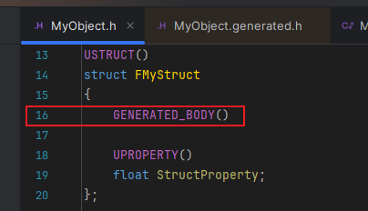
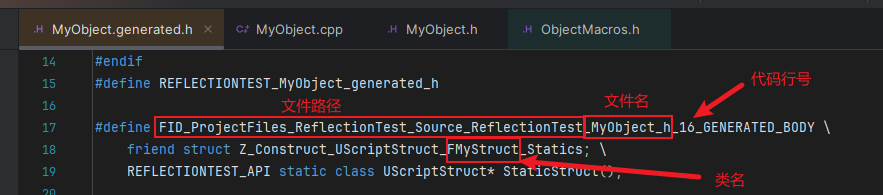

#### 对应版本: UE5.5

## REFERENCE
https://cloud.tencent.com/developer/article/1606872
<br><br><br>

### 1.词法分析
词法分析阶段主要在UHT中, 本文主要研究生成后的代码, 有兴趣的可以在UhtTokenBufferReader.cs中查看

<br><br><br>

### 2.反射代码生成
#### 2.1环境配置
UHT扫描之后会生成.h和.cpp两个文件:
.generated.h文件: 重载各种操作符函数, 声明各种构造函数
.gen.cpp文件: 单例实现, 构造UClass(提取信息并注册)

创建一个简单的头文件来研究反射实现:

MyObject.h:
```
#pragma once

#include "CoreMinimal.h"
#include "MyObject.generated.h"

UENUM()
enum class EMyEnum
{
	Enum1 = 1,
	Enum2 = 2,
};

USTRUCT()
struct FMyStruct
{
	GENERATED_BODY()

	UPROPERTY()
	float StructProperty;
};

UINTERFACE()
class UMyInterface : public UInterface
{
	GENERATED_BODY()
};

class IMyInterface
{
	GENERATED_BODY()
public:
	UFUNCTION()
	virtual void InterfaceTestFunction();
};

UCLASS()
class REFLECTIONTEST_API UMyObject : public UObject
{
	GENERATED_BODY()
	
public:
	UFUNCTION()
	void ClassFunction() {};

	UPROPERTY()
	int ClassProperty;
};
```
<br><br>
#### 2.2反射代码注入机制
首先来到MyObject.h的16行找到FMyStruct的GENERATED_BODY()宏:
\
宏的定义在ObjectMacros.h中:

编译之后, 再打开MyObject.generated.h
首先能看到这一段代码:

可以看到UE为每个类生成了一个专门的反射数据收集类, 以友元类的方式来访问类信息, 生成的友元类以Z_开头是为了在IDE的智能提示中排到最底下
<br><br>
#### 2.3反射信息收集
