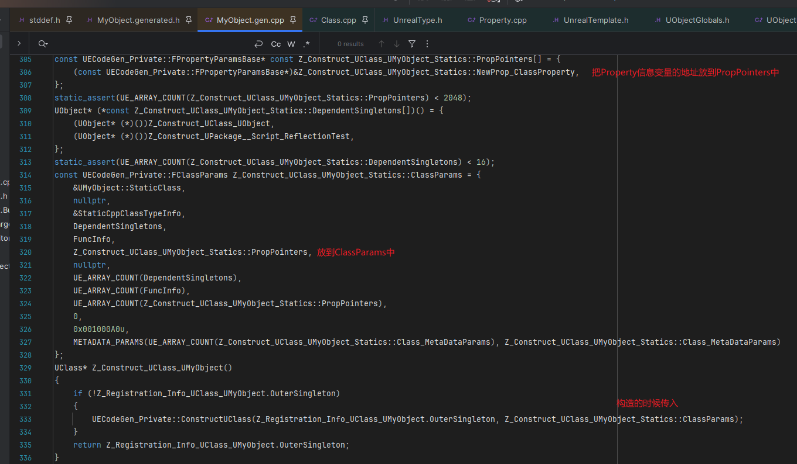

#### 对应版本: UE5.5

## REFERENCE
https://cloud.tencent.com/developer/article/1606872\
https://zhuanlan.zhihu.com/p/24319968
<br><br><br>

### 1.词法分析
词法分析阶段主要在UHT中, 本文主要研究生成后的代码, 有兴趣的可以在UhtTokenBufferReader.cs中查看

<br><br><br>

### 2.反射代码生成
#### 2.1环境配置
UHT扫描之后会生成.h和.cpp两个文件:
.generated.h文件: 重载各种操作符函数, 声明各种构造函数
.gen.cpp文件: 单例实现, 构造UClass(提取信息并注册)

创建一个简单的头文件来研究反射实现:

MyObject.h:
```
#pragma once

#include "CoreMinimal.h"
#include "MyObject.generated.h"

UENUM()
enum class EMyEnum
{
    Enum1 = 1,
	Enum2 = 2,
};

USTRUCT()
struct FMyStruct
{
	GENERATED_BODY()

	UPROPERTY()
	float StructProperty;
};

UINTERFACE()
class UMyInterface : public UInterface
{
	GENERATED_BODY()
};

class IMyInterface
{
	GENERATED_BODY()
public:
    UFUNCTION()
	virtual void InterfaceTestFunction();
};

UCLASS()
class REFLECTIONTEST_API UMyObject : public UObject
{
	GENERATED_BODY()
	
public:
	UFUNCTION()
	void ClassFunction() {};

	UPROPERTY()
	int ClassProperty;
};
```
<br><br>

#### 2.2反射代码注入机制
首先来到MyObject.h的39行找到UMyObject的GENERATED_BODY()宏:\
\
宏的定义在ObjectMacros.h中:

编译之后, 再打开MyObject.generated.h
首先能看到这一段代码:
\
可以看到UE为每个类生成了一个专门的反射数据收集类, 以友元类的方式来访问类信息, 生成的友元类以Z_开头是为了在IDE的智能提示中排到最底下
<br><br>

#### 2.3反射信息收集
##### 2.3.1函数和类型信息注册
来到MyObject.gen.cpp中, 找到IMPLEMENT_CLASS_NO_AUTO_REGISTRATION(UMyObject)宏:
\
这个宏展开结果如下:
\
这段代码主要是传递当前类型的一些信息, 去构造UClass

接下来来到Class.cpp的GetPrivateStaticClassBody函数中:

这里主要是对类型信息进行注册

最后一行通过传入的RegisterNativeFunc这个函数指针找到在MyObject.gen.cpp中的定义
\
可以看到这里添加了函数名->函数地址的键值对
<br><br>

##### 2.3.2属性信息注册
先来到MyObject.gen.cpp中, 查看我们在UMyObject中声明的ClassProperty变量是如何被UHT处理的:

这里主要是定义了一个静态的FIntPropertyParams, 传入了名称、Flag、地址偏移等, 我们重点来看一下STRUCT_OFFSET这个宏:
\
最后宏展开可以看到它是获取了对应UProperty变量在类中的地址偏移

联想到平时用的反射接口, 正是通过这个地址偏移加上对应的对象实例地址, 来获得对象的对应UProperty数据:

这也是C++中可以通过变量名找到蓝图中声名的对应的FProperty, 再取到对应的值的原理

之后再进行一系列的传递, 最终传递到构造的位置:


最终所有信息都通过ClassInfo传递到了底端的FRegisterCompiledInInfo类型的static变量中

我们再来看一下FRegisterCompiledInInfo这个类型的定义:
\
继续深入来到RegisterCompiledInInfo的定义:

来到函数体的第三行的AddRegistration定义:

在这里我们的Class信息被收集到了Registrations这个数组中, 那么这些信息会在什么时候应用呢?答案是在UObject模块启动的时候

先来到UObject模块启动的位置:\
\
再来到UClassRegisterAllCompiledInClasses这个函数的定义:
\
所以引擎在UObject模块启动的时候处理了收集到的这些类信息, 这也是UE的反射数据处理原理, 通过static对象的构造函数来在全局main函数之前，执行反射系统的收集逻辑, 最后在UObject模块启动的阶段进行统一处理