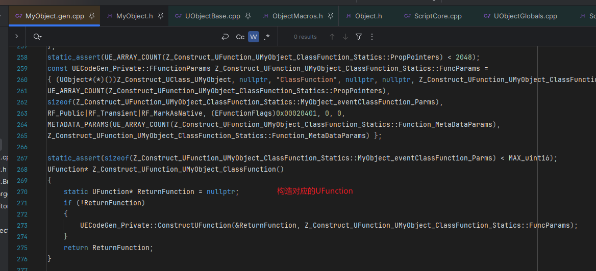

#### 对应版本: UE5.5

## REFERENCE
https://cloud.tencent.com/developer/article/1606872\
https://zhuanlan.zhihu.com/p/24319968
<br><br><br>

### 1.词法分析
词法分析阶段主要在UHT中, 本文主要研究生成后的代码, 有兴趣的可以在UhtTokenBufferReader.cs中查看

<br><br><br>

### 2.反射代码生成

先来看一下基本的反射宏


#### 2.1环境配置
UHT扫描之后会生成.h和.cpp两个文件:
.generated.h文件: 重载各种操作符函数, 声明各种构造函数
.gen.cpp文件: 单例实现, 构造UClass(提取信息并注册)

创建一个简单的头文件来研究反射实现:

MyObject.h:
```
#pragma once

#include "CoreMinimal.h"
#include "MyObject.generated.h"

UENUM()
enum class EMyEnum
{
    Enum1 = 1,
	Enum2 = 2,
};

USTRUCT()
struct FMyStruct
{
	GENERATED_BODY()

	UPROPERTY()
	float StructProperty;
};

UINTERFACE()
class UMyInterface : public UInterface
{
	GENERATED_BODY()
};

class IMyInterface
{
	GENERATED_BODY()
public:
    UFUNCTION()
	virtual void InterfaceTestFunction();
};

UCLASS()
class REFLECTIONTEST_API UMyObject : public UObject
{
	GENERATED_BODY()
	
public:
	UFUNCTION()
	int ClassFunction(int IntParam) { return 0; }

	UPROPERTY()
	int ClassProperty;
};
```
<br><br>

#### 2.2反射代码注入机制
首先来到MyObject.h的39行找到UMyObject的GENERATED_BODY()宏:\
\
宏的定义在ObjectMacros.h中:

编译之后, 再打开MyObject.generated.h
首先能看到这一段代码:
\
可以看到UE为每个类生成了一个专门的反射数据收集类, 以友元类的方式来访问类信息, 生成的友元类以Z_开头是为了在IDE的智能提示中排到最底下
<br><br>

#### 2.3反射信息收集
##### 2.3.1类型信息注册
来到MyObject.gen.cpp中, 找到IMPLEMENT_CLASS_NO_AUTO_REGISTRATION(UMyObject)宏:
\
这个宏展开结果如下:
\
这段代码主要是传递当前类型的一些信息, 去构造UClass. 平时我们常用的StaticClass函数最终返回的也是这个函数, 可以在UObject声明位置的DECLARE_CLASS宏中查看, 这里不再赘述

接下来来到Class.cpp的GetPrivateStaticClassBody函数中:

这里主要是对类型信息进行注册
<br><br>

##### 2.3.2UPROPERTY信息收集
先来到MyObject.gen.cpp中, 查看我们在UMyObject中声明的ClassProperty变量是如何被UHT处理的:

这里主要是定义了一个静态的FIntPropertyParams, 传入了名称、Flag、地址偏移等, 我们重点来看一下STRUCT_OFFSET这个宏:
\
最后宏展开可以看到它是获取了对应UProperty变量在类中的地址偏移

联想到平时用的反射接口, 正是通过这个地址偏移加上对应的对象实例地址, 来获得对象的对应UProperty数据:

这也是C++中可以通过变量名找到蓝图中声名的对应的FProperty, 再取到对应的值的原理

之后再进行一系列的传递, 最终传递到构造的位置:


最终所有信息都通过ClassInfo传递到了底端的FRegisterCompiledInInfo类型的static变量中

我们再来看一下FRegisterCompiledInInfo这个类型的定义:
\
继续深入来到RegisterCompiledInInfo的定义:


来到函数体的第三行的AddRegistration定义:

在这里我们的Class信息被收集到了Registrations这个数组中, 那么这些信息会在什么时候应用呢?答案是在UObject模块启动的时候

先来到UObject模块启动的位置:\
\
再来到UClassRegisterAllCompiledInClasses这个函数的定义:
\
所以引擎在UObject模块启动的时候处理了收集到的这些类信息, 这也是UE的反射数据处理原理, 通过static对象的构造函数来在全局main函数之前，执行反射系统的收集逻辑, 最后在UObject模块启动的阶段进行统一处理
<br><br>

##### 2.3.2UFUNCTION信息收集

先来到类型信息注册的最后一行, 通过传入的RegisterNativeFunc这个函数指针找到在MyObject.gen.cpp中的定义
\
可以看到这里添加了函数名->函数地址的键值对

接下来我们看看execClassFunction这个函数的定义\
\
宏展开之后得到

可以看到引擎声明了一个exec开头的包装函数, 供蓝图虚拟机使用, 内部还是调用的原生的函数

接下来看一下引擎对参数和返回值的处理

这里又是获取变量在类内的地址偏移, 来达到运行时动态获取反射属性数据的目的, 可以联想到平时在业务中写的使用C++调用蓝图函数的场景:
\
ProcessEvent传递进去的参数结构体其实就是对应gen.cpp里声明的参数结构体, 引擎底层也是通过反射数据中的地址偏移来从传入的结构体获取参数值

这些信息最后被用来构造成一个UFunction, 同时它也是一个UObject属性存在于UClass上, 详情可以看FindFunctionByName, 这里不再赘述:

UFunction信息传入UClass的位置:


至此整个UFUNCTION信息收集流程结束
<br><br>

以上内容主要是针对UMyObject的反射信息, 接下来简略看一下引擎的其它反射类型的信息收集
##### 2.3.3USTRUCT信息收集
UStruct中不能包含UFUNCTION的反射函数, 只允许C++原生函数, 其他内容和UObject相差不大, 最后注册返回的是一个UScriptStruct:

<br><br>

##### 2.3.4UINTERFACE信息收集
UINTERFACE定义时就比较不一样, 需要定义两个类, 一个是UMyInterface类, 继承UInterface, 其中什么数据都没有. 另一个是IMyInterface类, 什么都不继承

UMyInterface类生成的代码与UMyObject基本是一样的, 只是声明了一个反射类. 区别只是设置了ClassFlag为CLASS_Abstract和CLASS_Interface：

IMyInterface中也没做什么特殊处理, 只是把函数的实现放到了这个类中:
\
关键在于UMyInterface的反射信息传递的是IMyInterface中的函数:

所以为什么要用两个类来实现呢?
因为接口是存在多继承的, 一个类有可能继承多个接口. 如果每个接口都是UObject, 会出现菱形继承的情况. 而菱形继承会大大扩张虚表的大小, 而且会造成二义性, 调用基类的函数需要显示声明, 这肯定是不现实的这个时候, UINTERFACE用两个类来实现, 就可以避免菱形继承的问题. 外部类如果要继承接口的话, 只能继承IMyInterface类

另外这里还有一点值得注意: 如果一个类继承了UINTERFACE, 在InterfaceParams里面会传入多重继承的指针偏移offset(通过VTABLE_OFFSET获取), 因为接口是使用多继承, 因此需要通过指针偏移, 来根据Obj + Offset来获取接口地址调用接口函数
<br><br>

##### 2.3.4UENUM信息收集

