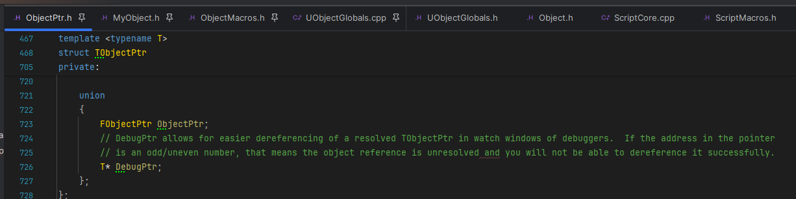
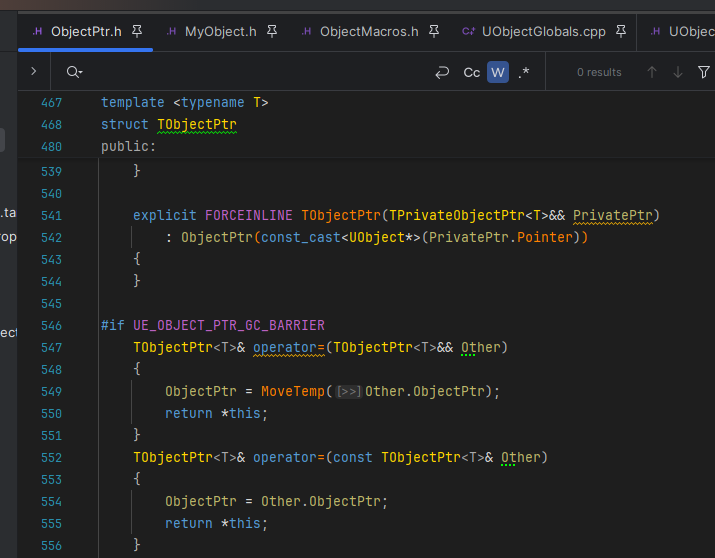
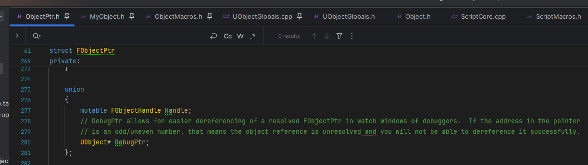
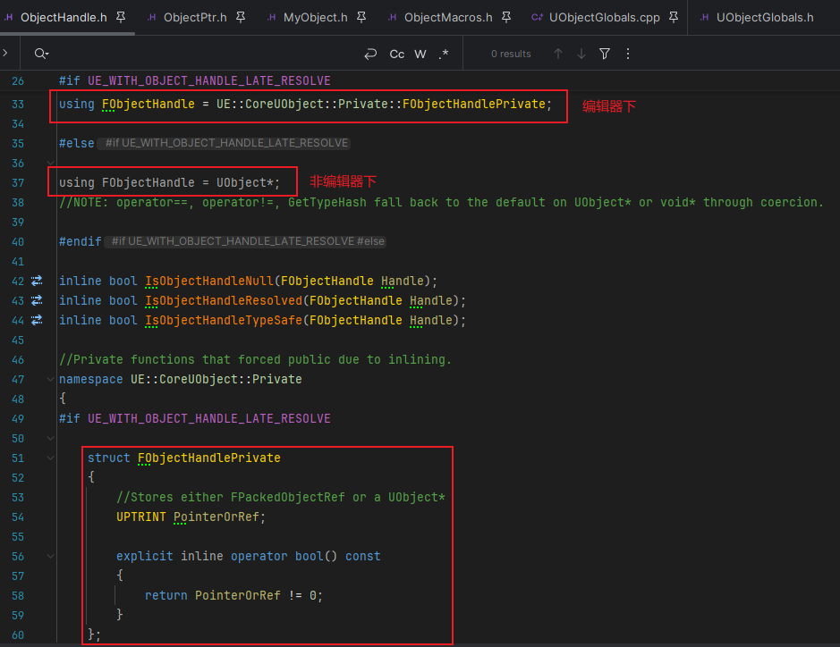
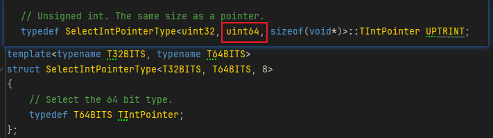
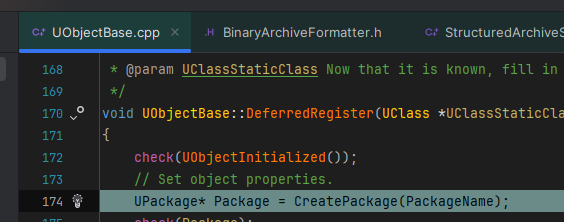

#### 对应版本: UE5.5

## REFERENCE
https://zhuanlan.zhihu.com/p/504115127
   

在UE5中, 新增了对象指针类型TObjectPtr以提供编辑器下动态解析和访问追踪功能. 很多引擎类的UPROPERTY的UObject\*类型的裸指针也被替换成了TObjectPtr<UObject>(例如AActor的RootComponent成员). 而在非编辑器下, TObjectPtr<UObject>会退化为UObject\*, 从而避免额外的运行时开销

### 1.为什么要引入TObjectPtr
在UE4中, 很多引擎类型的成员是UObject\*裸指针, 其中只记录内存地址. 由于内存地址在每次运行时都会发生变化, 这就给编辑器下的序列化静态保存、延迟加载等带来了不便. 此外, 裸指针也不能提供访问追踪功能, 这会在对UObject进行访问Debug时带来极大的不便: 需要事先封装Getter/Setter函数(若在出现Bug后再封装则需要涉及代码重构, 成本很大), 且不能追踪反射等非直接的访问

由于UE5放弃了对32位系统的支持, 从而只考虑64位的指针. 而在现有的硬件条件下, 寻址空间不可能将指针的64位全部用完. 因此, 这64位就可以用来存储额外的信息: 这样就可以把UObject的静态引用关系编码到这64位中, 运行时再解析为内存地址. 同时, 在这种封装中, 就可以在访问变量等需要Debug的时机加入Hook点, 这样就可以很方便的通过注册Hook函数进行Debug

而在另一方面, 在不需要Debug的情况下(如Release版本), 这些封装与Hook等新引入的特性不应带来额外的性能开销, 它们的效用应该与UObject\*裸指针没有区别

由此得出TObjectPtr特性:
1. 信息封装: 将Object的静态信息封装到64位中, 以便序列化静态保存、延迟加载等
2. 动态解析: 将封装的64位信息可以在运行时解析为UObject\*指针
3. Debug追踪: 在对FObjectPtr进行访问和动态解析时, 可以通过Hook的方式获取此次访问/解析的信息以供Debug
4. 还原: 在如Release等不需要上述功能的情况下, TObjectPtr应退化为UObject\*裸指针, 不应增加额外性能开销
   

### 2.TObjectPtr与FObjectPtr成员变量结构
先看一下TObjectPtr的成员变量:

可以看到它只包含了一个union, 由一个FObjectPtr和一个DebugPtr组成, DebugPtr是给调试器看的, 如果DebugPtr是奇数地址(即地址最低位是1), 说明该对象引用还没有解析(unresolved), 这时不能解引用它(即不能访问它指向的对象)

再看一下ObjectPtr的赋值:

ObjectPtr是由传入的UObject指针来构造或者从其它TObjectPtr拷贝的, TObjectPtr的功能实现都在FObjectPtr类型的ObjectPtr变量中

进一步来到FObjectPtr的成员变量:

与TObjectPtr类似, FObjectPtr也只有一个成员变量, 类型是FObjectHandle

FObjectHandle:

在非编辑器下FObjectHandle对应的是一个UObject裸指针\
在编辑器下FObjectHandle对应的是FObjectHandlePrivate, 它的成员变量是一个UPTRINT类型的PointerOrRef, 翻到最底层的typedef发现是一个uint64

### 3.信息封装
先来到反射信息的延迟注册阶段

在这里会给每个反射的UClass生成一个对应的UPackage

如果对UE的反射系统不熟悉可以先看[Reflection](Reflection.md)